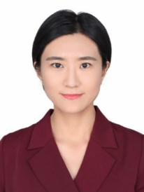

## 课程介绍

### 课程目的

理解和实现多种机器学习方法，并将其运用在具体生物学问题上。

### 课程安排

**理论课**共 17 周，每周 2 课时

1. 人工智能及生物学应用简介（2课时）

2. 数学及编程基础（2课时）

3. 机器学习基础（1课时）

4. 线性模型（3课时）

5. 支持向量机（2课时）

6. 集成学习（2课时）

7. 神经网络和深度学习（18课时）

   - 第一节 神经网络和pytorch简介

   - 第二节 线性神经网络和多层感知机

   - 第三节 卷积神经网络

   - 第四节 现代卷积神经网络

   - 第五节 神经网络在生物学的应用（一）

   - 第六节 自监督学习和预训练

   - 第七节 注意力机制

   - 第八节 语言模型

   - 第九节 神经网络在生物学的应用（二）

8. 课程项目汇报和课程总结（4课时）

**上机课** 6 次（每 3 周一次），前 5 次每次提交一个编程作业，最后一次用于汇报。编程作业的截止时间一般为发布一周后（可缓交或迟交，但不推荐）。

### 课程考核方式

**上机作业**

- 5 次作业

**期末小项目**

- 利用数据建模并写一个小论文

- 分组，每组 1~3 人

- 组队时建议数学、编程相互补充

**成绩评定**

- 上课考勤占总成绩的 10%

- 上机作业占总成绩的 50%

- 期末小项目占总成绩的 40%

### 教师团队

<table style="margin: auto;">
  <tr>
    <td align="center">
       
      <a href="https://lifesciences.sysu.edu.cn/zh-hans/teacher/1029">李彩</a>
    </td>
    <td align="center">
       
      <a href="https://lifesciences.sysu.edu.cn/zh-hans/teacher/1751">阮永森</a>
    </td>
    <td align="center">
       
      <a href="https://lifesciences.sysu.edu.cn/zh-hans/teacher/1073">徐锦</a>
    </td>
  </tr>
</table>

### 助教

课程出勤问题及与作业有关的问题可通过企业微信或邮箱联系助教蒋宗琎。

助教邮箱：jiangzj6@mail2.sysu.edu.cn
